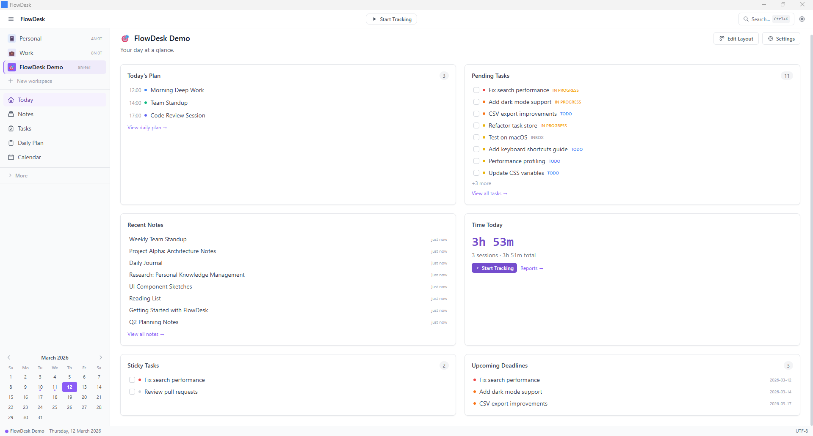
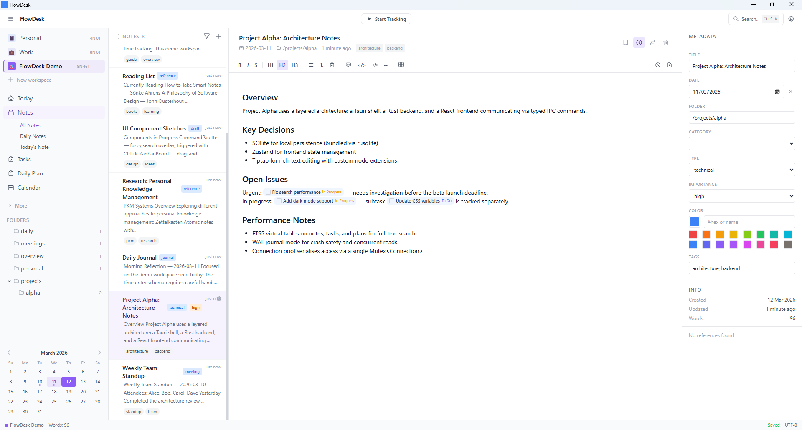
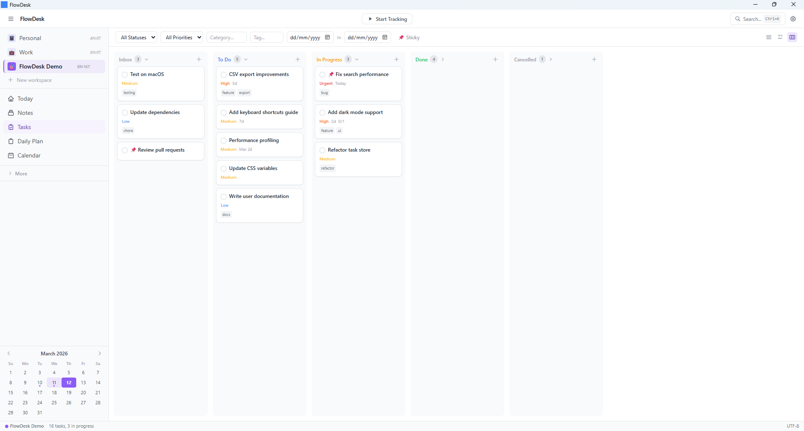
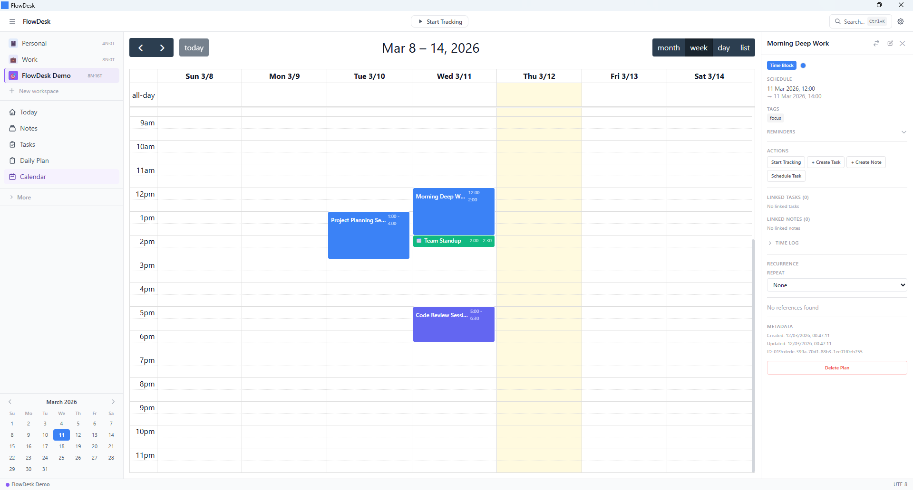
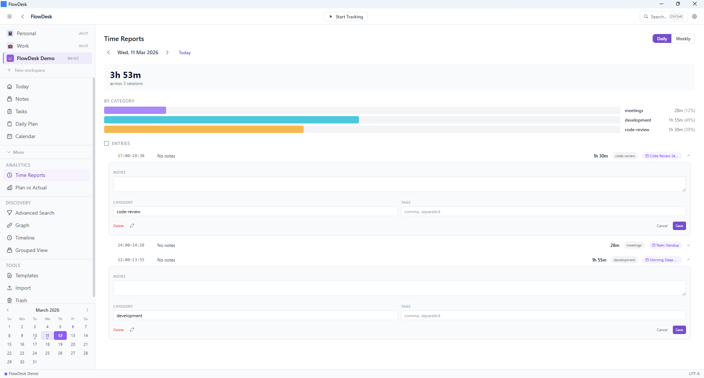
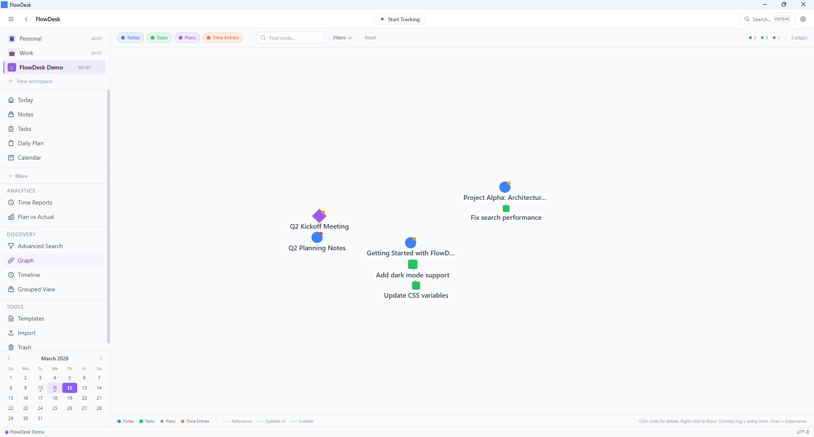
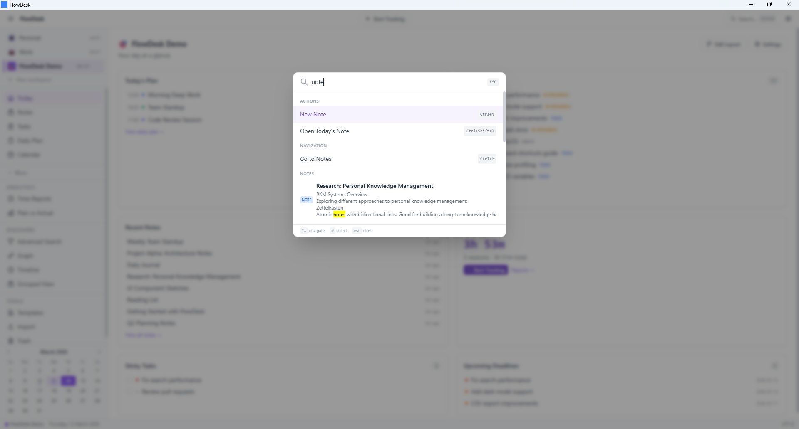
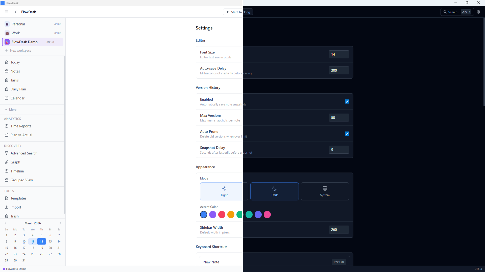

# FlowDesk

FlowDesk is a local-first desktop productivity app for managing notes, tasks, plans, and time tracking in a single interface. It runs entirely on your machine with no account, no cloud sync, and no external dependencies at runtime.

Current version: v0.8.22 (pre-1.0). There are no automated tests yet. The app is Windows-first; macOS and Linux builds are CI-compiled but untested on real hardware.

---

## Why FlowDesk

Most productivity tools solve one problem well and leave you stitching the rest together yourself. Notion is a great notes app. Linear is a great task tracker. Toggl is a great time tracker. But your work doesn't stay in neat silos — a task comes from a meeting note, a time entry belongs to a plan, a plan references a task that's blocking three others.

FlowDesk keeps all of it in one place, on your machine, connected:

**Everything is linked.** Notes can reference tasks, plans, and other notes with inline `@` chips. The Graph view shows the full web of relationships across your workspace. Backlinks tell you which notes mention a given task. You don't lose context when switching between views.

**Time tracking is a first-class citizen, not an afterthought.** Sessions link directly to plans and tasks. The Planned vs. Actual report shows where your day actually went versus where you intended it to go. The tracker lives in the system tray and stays out of the way until you need it.

**It's entirely local.** No account. No sync server. No subscription. Your data is a single SQLite file you can back up, inspect, and move. Nothing leaves your machine.

**It's fast to navigate.** The Command Palette (Ctrl+K) searches across every note, task, and plan simultaneously. Keyboard shortcuts cover the full workflow. Quick Capture (Ctrl+Shift+Space) lets you record a thought or start a task without breaking focus.

**Workspaces are isolated by design.** Work, personal, and side projects each get their own notes, tasks, plans, and accent color. Cross-workspace references are supported when you genuinely need them, but the default is clean separation.

---

## Features

### Notes
- Rich text editor with Markdown shortcuts (Tiptap)
- Folder tree organization
- Full-text search via SQLite FTS5
- Tags, pinning, and note metadata
- Inline references to tasks with @task[id] chips
- Note version history with line-level diffs
- Markdown templates with YAML front matter

### Tasks
- Task list with status, priority, due date, and tags
- Kanban board with drag-and-drop columns
- Sticky tasks pinned to the top of lists
- Backlinks: shows notes that reference a task
- Recurrence rules with auto-generation on completion

### Plans
- Plan entities linked to tasks and time entries
- Planned vs. actual time comparison

### Time Tracker
- Start, pause, resume, and stop sessions
- System tray integration with tracker controls
- Break reminder scheduler
- Tracker stop suggestions based on task context

### Workspaces
- Multiple named workspaces, each isolated with its own data
- Per-workspace accent color and dashboard widget configuration
- Cross-workspace entity references

### Discovery
- Activity log for recent opens and edits
- Graph view of entity relationships
- Timeline and grouped views
- Faceted search with filters by type, status, tag, and workspace
- Backlinks panel with snippet context

### Other
- Command palette (Ctrl+K) with fuzzy search
- Configurable keyboard shortcuts
- Undo/redo for note and task edits
- Import: Markdown folder, Obsidian vault, CSV tasks
- Export: JSON workspace, CSV tasks, Markdown
- Dark mode and theme configuration
- Quick capture widget (Ctrl+Shift+Space)

---

## Screenshots



<table>
<tr>
<td></td>
<td></td>
</tr>
<tr>
<td></td>
<td></td>
</tr>
<tr>
<td></td>
<td></td>
</tr>
</table>



---

## Building from Source

### Prerequisites

- Node.js 20 or later
- Rust stable (install via [rustup](https://rustup.rs))
- npm

On Windows, the Tauri build also requires the WebView2 runtime (included with Windows 11) and either the MSVC or GNU toolchain.

On **macOS**, Xcode Command Line Tools are required (`xcode-select --install`). For Apple Silicon, add the `aarch64-apple-darwin` Rust target (`rustup target add aarch64-apple-darwin`). For Intel, add `x86_64-apple-darwin` instead.

> **macOS caution:** macOS builds are CI-compiled but not tested on real hardware. System tray behavior, global hotkeys (Ctrl+Shift+Space, Ctrl+K), and the WebView2-equivalent (WKWebView) may behave differently. The app has not been code-signed or notarized, so Gatekeeper will block it on first launch — right-click → Open to bypass.

On **Linux** (Ubuntu/Debian), install the required system libraries before building:

```sh
sudo apt-get install -y \
  libwebkit2gtk-4.1-dev \
  libappindicator3-dev \
  librsvg2-dev \
  patchelf \
  libgtk-3-dev \
  libsoup-3.0-dev \
  libjavascriptcoregtk-4.1-dev
```

> **Linux caution:** Linux builds are CI-compiled but not tested on real hardware. The system tray requires a compatible tray host (e.g., GNOME with AppIndicator extension, KDE, or XFCE). Global hotkeys may not register in all desktop environments. The `libwebkit2gtk-4.1` version requirement means Ubuntu 22.04 or later (or equivalent).

### Steps

```sh
git clone https://github.com/your-username/flowdesk.git
cd flowdesk

# Install frontend dependencies
# --legacy-peer-deps is required because Tiptap has a peer conflict between
# its v2 and v3 packages that ships in the published npm metadata.
npm install --legacy-peer-deps

# Run in development mode (opens a dev window with hot reload)
npm run tauri dev

# Build a release binary
npm run tauri build
```

The release binary and installer are written to `src-tauri/target/release/bundle/`.

---

## Data Storage

FlowDesk stores all data in a SQLite database at:

- Windows: `%APPDATA%\FlowDesk\flowdesk.db` (typically `C:\Users\<name>\AppData\Roaming\FlowDesk\`)
- macOS: `~/Library/Application Support/FlowDesk/flowdesk.db`
- Linux: `~/.local/share/FlowDesk/flowdesk.db`

Note templates are stored as Markdown files in the same directory under `templates/`.

No data leaves your machine. There is no telemetry, no analytics, and no network requests at runtime beyond what Tauri itself requires for the WebView.

---

## Tech Stack

| Layer | Technology |
|---|---|
| Desktop shell | Tauri 2 |
| Backend | Rust |
| Database | SQLite via rusqlite 0.32 (bundled) |
| Frontend framework | React 18 |
| State management | Zustand |
| Rich text editor | Tiptap |
| UI styling | Tailwind CSS |
| Drag and drop | @dnd-kit |
| Graph view | react-force-graph-2d |

---

## License

MIT. See [LICENSE](./LICENSE).
